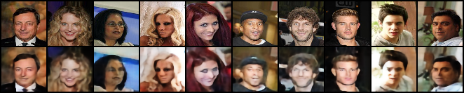
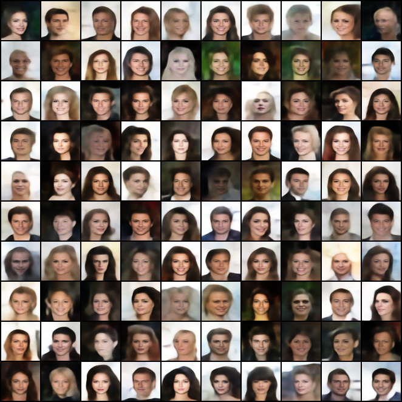

# VQ-VAE_Transformer on CelebA
## Introduction
This report presents my implementation of an approach of generating new samples using VQ-VAE and transformer. This work involves a two-stage process for image generation. I first implemented a ResNet-style encoder and decoder for the VQ-VAE to reconstruct the input data, and then a transformer to model the latent representations of the VQ-VAE. Experiments were conducted on MNIST, Fashion-MNIST, and CelebA. The results demonstrate the capability of VQ-VAE for reconstruction and Transformers in learning the distribution of a sequence of discrete latents. A comparative analysis was performed to reveal how specific parameters can influence the model capability.
More details can be found in Variational_Autoencoders.pdf

## Download the dataset
This model uses CelebA dataset. First please download the dataset folder and then use the file source/celeba64.py to convert the images to 64x64 and store it in .npz file, and store it in data/CelebA.

## How to run
To run the model, go to the working directory, and type "python VQ-VAE-Transformer_CelebA/vqvae.py" in the terminal, the VQ-VAE model will be trained by default parameters. Then run "python VQ-VAE-Transformer_CelebA/transformer.py" to train the transformer. If you change parameters, remember to make the parameters consistent in two files. You can look at how to change hyperparameters by running "python VQ-VAE-Transformer_CelebA/vqvae.py -h" or "python VQ-VAE-Transformer/trasnformer.py -h" and use command line codes to change them. e.g., the dataset used for training, the latent dimension .etc.

## Result
You can visualize the training result by looking at /result folder, including the training curve, the reconstructed image, and the generation result. Sample reconstruction results is as follows:

Sample generating results is as follows:

